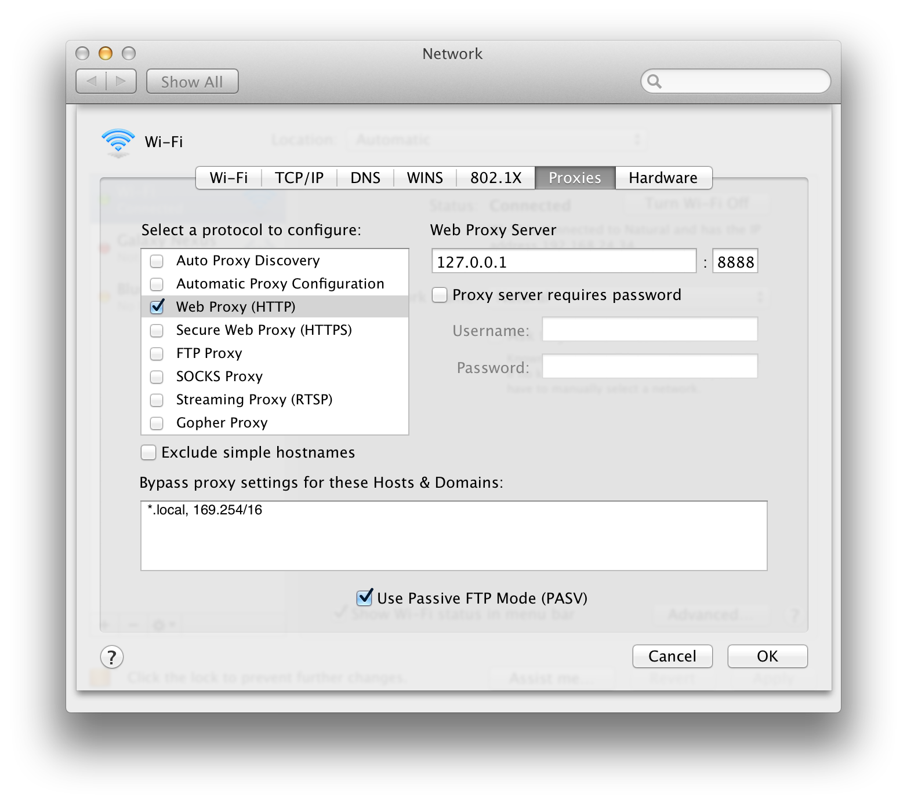
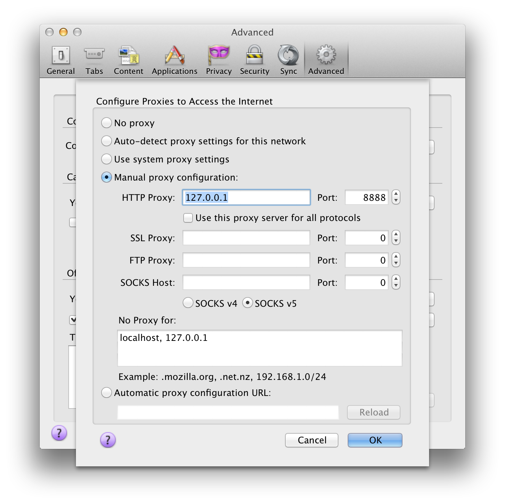
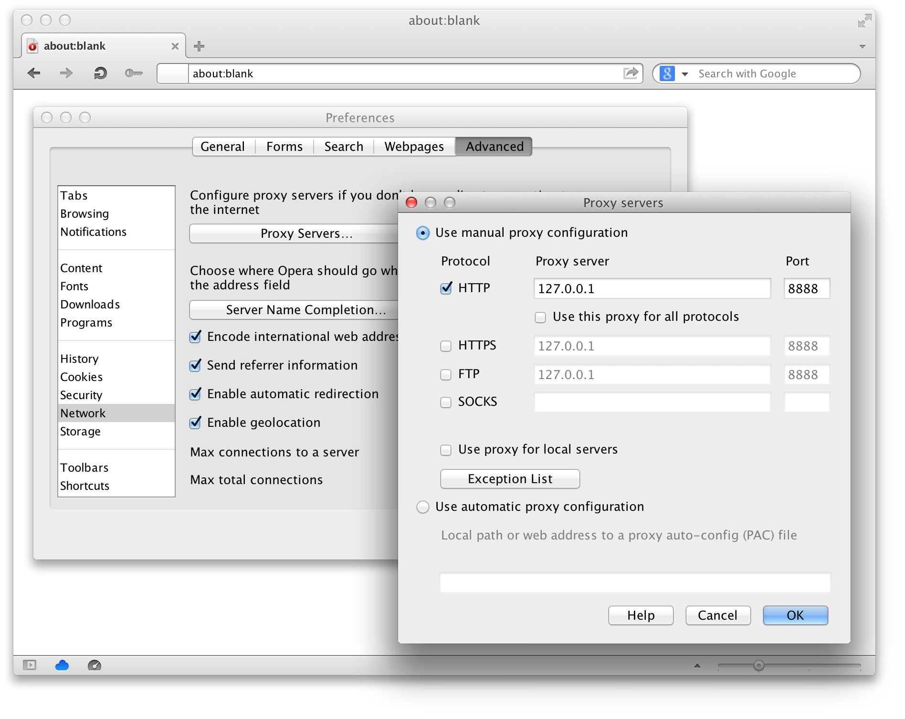

Using
=====

Suppose :program:`wsgi-proxy` is listening 127.0.0.1:8888.  You can set
it using :option:`--host <wsgi-proxy --host>` and :option:`--port
<wsgi-proxy --port>` options:

.. sourcecode:: console

   $ wsgi-proxy --host 127.0.0.1 --port 8888

Mac OS X
--------

There is system-wide settings for HTTP proxy in Mac OS X.  It affects to
Safari and Google Chrome.  You can find it on
:menuselection:`System Preferences... --> Network --> Advanced... --> Proxies`.
Switch on :guilabel:`Web Proxy (HTTP)`, and then fill host and port number of
:guilabel:`Web Proxy Server` to 127.0.0.1 and 8888.

Mozilla Firefox
---------------

Firefox provides its own proxy settings.  You can find it on
:menuselection:`Preferences... --> Advanced --> Network --> Connection --> \
Settings...`.  Choose :guilabel:`Manual proxy configuration`, and then fill
:guilabel:`HTTP Proxy` to 127.0.0.1 and its :guilabel:`Port` to 8888.

Opera_
------

Opera_ provides its own proxy settings.  You can find it on
:menuselection:`Preferences... --> Advanced --> Network --> Proxy Servers...`.
Choose :guilabel:`Use manual proxy configuration`, and then fill
:guilabel:`Proxy server` and :guilabel:`Port` of :guilabel:`HTTP` to
127.0.0.1 and 8888.

.. _Opera: http://www.opera.com/

:envvar:`http_proxy`
--------------------

A lot of Unix utilities e.g. :program:`curl`, :program:`wget` and networking
libraries e.g. :mod:`urllib2` respect :envvar:`http_proxy` environment
variable.

.. sourcecode:: console

   $ http_proxy="127.0.0.1:8888" curl http://python.org/
   $ http_proxy="127.0.0.1:8888" wget http://python.org/

`GNU Wget`_
-----------

:program:`wget` command respects :envvar:`http_proxy` environment variable:

.. sourcecode:: console

   $ http_proxy="127.0.0.1:8888" wget http://python.org/

.. _GNU Wget: http://www.gnu.org/software/wget/

curl_
-----

:program:`curl` command provides :option:`--proxy1.0` option:

.. sourcecode:: console

   $ curl --proxy1.0 127.0.0.1:8888 http://python.org/

It respects :envvar:`http_proxy` environment variable as well:

.. sourcecode:: console

   $ http_proxy="127.0.0.1:8888" curl http://python.org/

.. _curl: http://curl.haxx.se/
